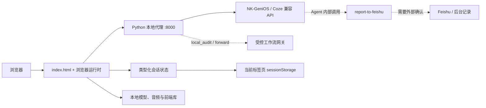

<div align="center">
  
  <h1>校园心灵驿站</h1>
  <p>AIUE · 面向校园场景的心理陪伴与自然对话式状态自我了解 Web 原型</p>
  <p>
    <a href="#项目简介">项目简介</a> ·
    <a href="#界面预览">界面预览</a> ·
    <a href="#核心功能">核心功能</a> ·
    <a href="#技术架构">技术架构</a> ·
    <a href="#快速开始">快速开始</a> ·
    <a href="#文档导航">文档导航</a>
  </p>
</div>

## 项目简介

校园心灵驿站是一个面向大学校园场景的心理健康对话式无感知测评原型。学生可以先通过自然语言表达最近的困扰，再按需要完成补充量表，并在同一会话中查看状态回顾和记录状态。

项目当前以 `index.html` 为活动页面入口，浏览器侧负责界面、对话交互和类型化会话状态；Python 本地代理负责静态资源、流式聊天请求和受控的后台记录接口；上游 AI 能力通过 NK-GeniOS / Coze 兼容接口接入。项目是实验性原型，不是医疗软件、正式心理咨询、正式心理测评系统或紧急服务。

## 核心功能

- **暖心伙伴**：通过流式对话提供日常情绪陪伴；3D 伙伴可以在开心、点赞、运动、学习、休息、害羞和拒绝等状态之间切换，也会根据部分表达自动切换状态。
- **自然对话式记录**：把会话阶段、主要困扰、持续时间、情绪、功能影响、支持系统和安全确认等信息维护为结构化状态，避免把对话强行变成固定问卷。
- **补充测评**：内置 PHQ-9 抑郁症状筛查量表和 GAD-7 广泛性焦虑症状筛查量表；作答和计分在本地完成，结果仅作筛查和自我了解参考，不构成诊断。
- **安全边界**：对明确或模糊的安全相关表达进入更谨慎的支持路径；学生端只显示现实支持提示，不展示内部规则标签，也不会把信息缺失默认为“没有风险”。
- **状态回顾**：提供当前状态概览和多维状态扫描视图；后台报告使用非诊断性模板，完整报告内容不直接展示给学生。
- **放松空间**：提供吸气/呼气节奏动画和雨声、森林鸟鸣、篝火声、风声、夏夜虫鸣五种本地白噪音；同一时间只播放一种声音，并支持独立调节音量。
- **语音与响应式界面**：支持浏览器语音输入、Enter 发送、移动端悬浮导航、夜间模式和当前标签页会话恢复。
- **受控记录链路**：支持 `agent_internal`、`disabled`、`mock_success`、`mock_failure`、`local_audit` 和 `forward` 等本地验证模式；浏览器不直接调用 Feishu，API 密钥只应放在服务端环境变量中。

## 技术架构



| 模块 | 技术与职责 |
| --- | --- |
| 活动页面 | `index.html`、原生 HTML/CSS/JavaScript，承载当前单页原型和兼容性全局事件入口 |
| 浏览器运行时 | `src/app/`，负责页面编排、聊天流、导航、语音、3D 模型、白噪音、量表和记录状态 |
| 类型化业务层 | `src/domain/`、`src/services/`、`src/contracts/`、`src/utils/`，维护会话、对话阶段、测评、安全、转录、报告和工作流边界 |
| 本地代理 | Python 标准库实现的 `server/proxy_server.py`，提供静态文件、`/api/chat` SSE 转发和受控工作流接口；根目录 `proxy_server.py` 是兼容启动包装器 |
| 静态资源 | `public/` 保存 GLB 3D 模型、白噪音、应用图标、PWA manifest 和 TypeScript 编译产物 |
| 前端依赖 | `libs/` 提供本地化的 Chart.js、Marked、Model Viewer 和 Font Awesome，减少对 CDN 的运行时依赖 |
| 验证与文档 | `scripts/`、`tests/`、`__tests__/`、`docs/` 分别提供本地/实时验证、人工用例、自动化测试和工程文档 |

### 目录结构

```text
Nankai_AIUE/
├─ index.html                 # 当前活动的单页入口
├─ proxy_server.py            # 本地代理兼容启动包装器
├─ server/                    # Python 代理、模拟网关和配置示例
├─ src/
│  ├─ app/                    # 浏览器运行时与页面编排
│  ├─ domain/                 # 类型化的非诊断性领域状态
│  ├─ services/               # 会话、聊天、报告和工作流服务
│  ├─ contracts/              # 跨浏览器、代理和工作流的接口契约
│  ├─ styles/                 # 当前页面使用的样式层
│  └─ utils/                  # SSE、文本和时间等纯辅助函数
├─ public/
│  ├─ models/                 # 3D 伙伴 GLB 模型
│  ├─ audio/                  # 白噪音资源
│  ├─ images/                 # 应用图标
│  └─ runtime/                # 由 TypeScript 生成的浏览器模块
├─ libs/                      # 本地第三方前端库
├─ scripts/                   # 启动、冒烟、联调和验证脚本
├─ tests/                     # 人工测试、集成检查和记录模板
├─ __tests__/                 # Node.js 自动化测试
├─ docs/                      # 架构、运行、联调和维护文档
├─ archive/                   # 不参与运行的历史资料与回滚材料
├─ package.json
└─ README.md
```

`src/` 是长期维护的源码层，`public/runtime/` 是生成物。修改 TypeScript 后请运行 `npm run runtime:build`，不要直接编辑 `public/runtime/`。

## 界面预览

以下截图由当前版本的本地应用页面生成，使用的是合成身份和本地静态/模拟环境。

<table>
  <tr>
    <td align="center" width="50%">
      <strong>登录与知情边界</strong><br><br>
      
    </td>
    <td align="center" width="50%">
      <strong>暖心伙伴对话</strong><br><br>
      
    </td>
  </tr>
  <tr>
    <td align="center" width="50%">
      <strong>补充测评</strong><br><br>
      
    </td>
    <td align="center" width="50%">
      <strong>我的状态</strong><br><br>
      
    </td>
  </tr>
  <tr>
    <td align="center" colspan="2">
      <strong>白噪音空间</strong><br><br>
      
    </td>
  </tr>
</table>

### 截图补充要求

- 当前截图使用 JPG，画布为 `1280x720`；后续替换时也可使用 PNG，建议画布为 `1440x900` 或 `1600x1000`，只截取应用界面，不要包含开发者工具、终端或无关窗口。
- `login.png`：显示“校园心灵驿站”标题、姓名/学号入口和非诊断性边界说明；输入框保持空白或使用脱敏示例。
- `companion.png`：显示 3D 伙伴、至少一轮对话气泡和状态切换按钮；对话内容使用合成文本，不要展示真实隐私或完整后台报告。
- `assessment.png`：显示 PHQ-9/GAD-7 量表目录或作答页，能看见题目选项和“仅作筛查参考、不构成诊断”的提示。
- `profile.png`：显示状态概览与多维状态扫描；请使用合成会话，不能把雷达图误解为临床诊断结果。
- `meditation.png`：显示呼吸节奏圆和五种白噪音卡片，最好能体现音量控件。
- 所有截图都不得包含 API Key、真实姓名、真实学号、聊天隐私、Feishu 记录或其他敏感信息。若需要移动端展示，可另补一张 `mobile.png`，建议视口 `390×844`，画面中应能看见悬浮导航。

## 快速开始

### 环境要求

- Node.js 18+
- npm 9+
- Python 3.10+
- 若要进行真实对话联调，需要可用的 NK-GeniOS API Key 和 Bot ID

以下命令以 Windows PowerShell 为例，并假设当前目录是包含 `package.json` 与 `index.html` 的项目根目录。

### 1. 安装前端依赖

```powershell
npm install
```

Python 代理只使用标准库，不需要额外安装 `pip` 依赖。

### 2. 生成浏览器运行时模块

```powershell
npm run runtime:build
```

### 3. 配置服务端环境变量

API Key 只放在启动代理的终端环境中，不要写入 `index.html`、前端源码或 Git 仓库。

```powershell
$env:NANKAI_API_KEY = "replace_with_server_side_key"
$env:NANKAI_BASE_URL = "https://coze.nankai.edu.cn/api/proxy/api/v1"
$env:MENTAL_LLM_WORKFLOW_GATEWAY_MODE = "agent_internal"
```

`MENTAL_LLM_WORKFLOW_GATEWAY_MODE` 不设置时默认也是 `agent_internal`。本地冒烟测试会主动使用 `disabled` 模式，以验证错误边界。

### 4. 启动本地代理

```powershell
python proxy_server.py
```

浏览器访问 `http://127.0.0.1:8000/`。如果只需要查看静态页面，API Key 可以留空；发送聊天消息时，代理会返回受控的缺少密钥错误。

### 5. 启动 Vite 开发服务器（可选）

修改前端源码时，可以在另一个终端执行：

```powershell
npm run dev
```

Vite 默认运行在 `http://127.0.0.1:5173/`，并将 `/api` 请求代理到 `http://127.0.0.1:8000`。使用 Vite 时仍需保持 Python 代理运行。

### 工作流验证模式

| 模式 | 用途 |
| --- | --- |
| `agent_internal` | 当前直接使用路径；本地确认 Agent 内部记录请求，Feishu 写入仍需人工外部确认 |
| `disabled` | 模拟记录通道不可用，验证前端不会伪造提交成功 |
| `mock_success` | 返回合成的成功响应，不写入外部系统 |
| `mock_failure` | 返回合成的失败响应 |
| `local_audit` | 将受控审计记录写入 `server/workflow_audit/` 或环境变量指定目录 |
| `forward` | 由本地代理转发到已配置的内部工作流网关，不允许浏览器直连 Feishu |

使用 `forward` 模式时，还需要设置 `MENTAL_LLM_WORKFLOW_GATEWAY_URL`、`MENTAL_LLM_WORKFLOW_GATEWAY_AUTH_TOKEN` 以及可选的认证头和超时配置。完整变量说明见[本地运行说明](scripts/run_local.md)。

## 页面与接口入口

| 入口 | 内容 |
| --- | --- |
| `/` 或 `index.html` | 单页应用入口，首次打开会先显示学生身份和边界说明 |
| `暖心伙伴` | 流式心理陪伴对话、3D 伙伴状态切换和语音输入 |
| `补充测评` | PHQ-9 与 GAD-7 量表选择、作答、本地计分和结果边界提示 |
| `我的状态` | 当前状态概览、多维状态扫描和非诊断性记录状态 |
| `白噪音空间` | 呼吸节奏动画、本地白噪音播放和音量调节 |
| `POST /api/chat` | 本地代理转发聊天请求，响应为 SSE 流 |
| `GET /api/workflow/status` | 查询当前工作流模式和是否启用 |
| `GET /api/workflow/audit-records` | 读取受控审计摘要，不返回完整工作流请求体 |
| `POST /api/workflow/report-to-feishu` | 受控记录提交入口，实际行为由工作流模式决定 |

## 开发与验证

### 本地检查

```powershell
npm run typecheck
npm run test
npm run smoke
npm run validate:local
```

常用成功标记包括：

- `SMOKE_CHECK_PASS`
- `LOCAL_AUDIT_GATEWAY_PASS`
- `FORWARD_WORKFLOW_GATEWAY_PASS`
- `ALL_LOCAL_VALIDATIONS_PASS`

### 实时联调

实时检查需要在当前终端设置真实环境变量，建议只使用合成学生信息：

```powershell
$env:NANKAI_API_KEY = "replace_with_real_key"
$env:NANKAI_BOT_ID = "replace_with_bot_id"
$env:NANKAI_TEST_USER_ID = "synthetic_test_user_001"

npm run validate:live:preflight
npm run validate:live:chat
npm run validate:live:scenario
npm run validate:live
```

如果确实要验证可选的内部网关转发路径，再设置 `MENTAL_LLM_WORKFLOW_GATEWAY_MODE=forward` 和对应网关变量后运行：

```powershell
npm run validate:live:workflow
```

`npm run validate:live` 的自动化通过只代表 API、聊天和脚本路径通过。Agent 是否真正调用 `report-to-feishu`、Feishu 是否新增记录、授权查看者是否能看到记录，仍需按[外部联调手册](docs/operations/external_validation_runbook.md)人工确认。

## 使用边界与当前限制

- 本项目不提供医学诊断、正式心理咨询、正式心理测评结论或紧急处置；出现现实安全风险时，应优先联系身边可信赖的人、学校心理健康中心、医院或当地紧急服务。
- PHQ-9/GAD-7 结果只表示量表中的症状体验范围，不能单独用于诊断或判断风险；量表中文措辞和发布版本仍需按项目发布流程复核。
- `我的状态`中的雷达图当前包含演示性可视化数据，不能视为用户的真实临床评估结果。
- `agent_internal` 或 `local_audit` 的本地成功响应只表示本地记录链路已收到请求，不等价于 Feishu 写入成功；真实工作流和可见性必须单独验证。
- 真实运行前仍需确认学生数据授权、知情同意、脱敏、保存期限、访问权限和现实支持资源清单。
- 测试和截图请使用合成身份；不要提交 API Key、真实学生信息、聊天隐私或工作流审计原文。

## 文档导航

| 文档 | 内容 |
| --- | --- |
| [文档总览](docs/README.md) | 当前文档目录和阅读顺序 |
| [项目架构](docs/architecture/architecture.md) | 页面、运行时、服务和数据边界 |
| [Agent 集成](docs/architecture/agent_integration.md) | NK-GeniOS、工作流和后台记录链路 |
| [数据边界](docs/architecture/data_boundary.md) | 浏览器、代理、报告和审计数据的边界 |
| [本地运行说明](scripts/run_local.md) | 启动方式、环境变量和本地工作流模式 |
| [直接使用指南](docs/operations/direct_use_app_guide.md) | 当前原型的操作和人工确认步骤 |
| [外部联调手册](docs/operations/external_validation_runbook.md) | 实时 Agent、工作流和 Feishu 验证 |
| [当前状态矩阵](docs/operations/current_status_matrix.md) | 本地完成度和外部验证状态 |
| [测试说明](tests/README.md) | 自动化、人工和集成测试材料布局 |
| [人工测试用例](tests/manual/manual_cases.md) | 会话、安全、报告和工作流边界用例 |
| [源码层说明](src/README.md) | `src/` 下各层职责和维护规则 |
| [静态资源说明](public/README.md) | 模型、图标、manifest 和生成运行时 |
| [白噪音资源许可](public/audio/README.md) | 音频文件、播放行为和许可信息 |
| [归档索引](archive/README.md) | 历史材料、回滚基线和不参与运行的文件 |
