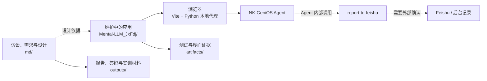
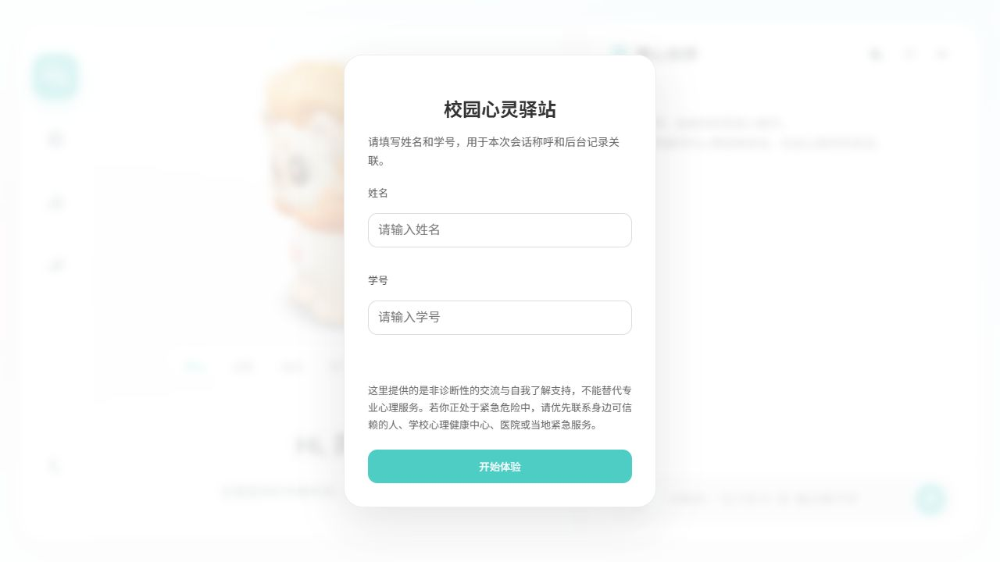
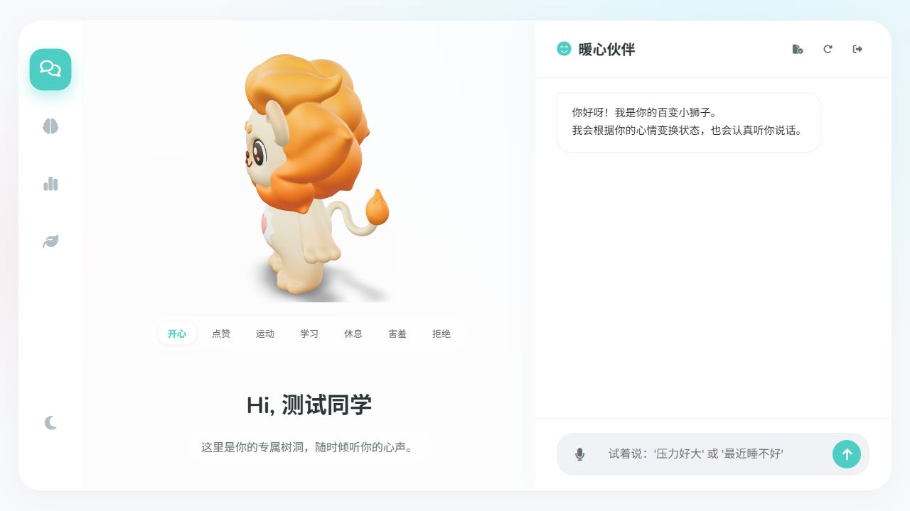
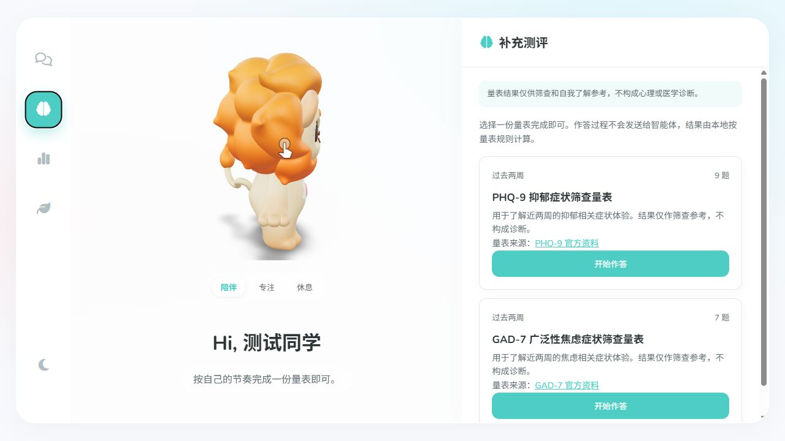
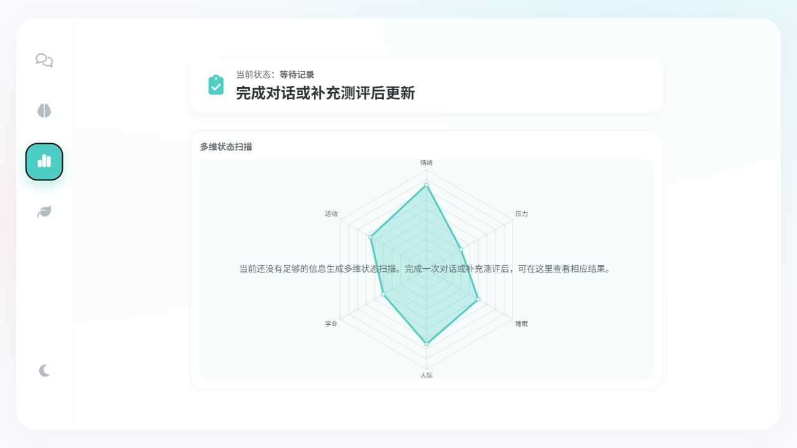
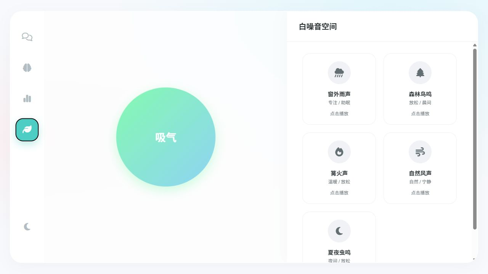

<div align="center">
  
  <h1>AIUE</h1>
  <p>校园心理健康对话评估智能体的研究、开发与验证工作区</p>
  <p>
    <a href="#项目简介">项目简介</a> ·
    <a href="#界面预览">界面预览</a> ·
    <a href="#核心内容">核心内容</a> ·
    <a href="#技术架构">技术架构</a> ·
    <a href="#快速开始">快速开始</a> ·
    <a href="#开发与验证">开发与验证</a> ·
    <a href="#文档导航">文档导航</a>
  </p>
</div>

## 项目简介

AIUE 是一个围绕高校心理健康对话评估智能体展开的混合型项目工作区，包含访谈研究、需求提炼、智能体与工作流设计、可运行的学生端原型、验证记录、阶段性报告和答辩/实训材料。

当前维护中的应用位于 `Mental-LLM_JxFdj/`。它面向校园场景提供自然语言陪伴、补充量表、状态回顾和后台记录准备，浏览器通过本地代理访问 NK-GeniOS Agent；完整报告不直接展示给学生，浏览器也不直接调用 Feishu。

项目目前处于“可运行应用 + 本地自动化验证 + 外部平台联调”的研究原型阶段。它不是医疗软件、正式心理咨询、正式心理测评系统或紧急服务。

## 核心内容

- **学生端应用**：`Mental-LLM_JxFdj/` 提供暖心伙伴对话、PHQ-9/GAD-7 补充测评、状态视图和白噪音空间。
- **自然对话评估**：将主要困扰、持续时间、情绪、功能影响、支持系统和安全确认维护为结构化状态，同时保留对话中的不确定、拒答和信息缺口。
- **安全与数据边界**：学生端使用非诊断性措辞；安全相关表达进入更谨慎的现实支持路径；报告和工作流 payload 由本地状态与模板生成。
- **Agent 与工作流**：本地代理负责静态文件、SSE 聊天转发、受控工作流网关和审计摘要；真实 `report-to-feishu` 调用及 Feishu 可见性仍需外部确认。
- **研究与设计材料**：`md/` 保存访谈原始材料、分析、需求、设计决策、开发路线、进度和验证记录；`outputs/` 保存阶段性交付物。
- **证据与复现材料**：`artifacts/` 保存持久化截图、结构审计和质量验证证据；`scripts/` 保存工作区级自动化脚本。

## 技术架构



| 模块 | 技术与职责 |
| --- | --- |
| 维护中的应用 | `Mental-LLM_JxFdj/`，包含 `index.html`、前端运行时、类型化状态、Python 代理、静态资源、测试和应用文档 |
| 浏览器运行时 | 原生 HTML/CSS/JavaScript、Vue/Vite 配置、TypeScript 生成的 `public/runtime/` 模块、Chart.js、Marked、Model Viewer 和 Font Awesome |
| AI 连接 | `Mental-LLM_JxFdj/server/proxy_server.py` 通过服务端环境变量读取 `NANKAI_API_KEY`，将 `/api/chat` 转发到 NK-GeniOS / Coze 兼容接口 |
| 报告与工作流 | 本地状态和报告模板生成非诊断性 payload；支持 Agent 内部、模拟、local audit 和受控 forward 模式 |
| 研究资料 | `md/` 负责原始资料、访谈分析、需求、设计、路线、进度和验证信息的项目级管理 |
| 交付与证据 | `outputs/` 保存报告、会议纪要、答辩和实训材料；`artifacts/` 保存截图、审计和验证证据 |

### 目录结构

```text
AIUE/
├─ Mental-LLM_JxFdj/          # 当前维护中的学生端应用
│  ├─ src/                     # 长期维护的源码与类型化业务层
│  ├─ public/                  # 模型、音频、图标和生成运行时
│  ├─ server/                  # Python 本地代理与模拟网关
│  ├─ scripts/                 # 应用启动、冒烟、联调和验证脚本
│  ├─ tests/                   # 人工测试与集成检查材料
│  ├─ docs/                    # 应用架构、运行、联调和维护文档
│  └─ README.md                # 应用级说明
├─ md/                         # 研究、设计、开发进度和验证文档
├─ outputs/                    # 阶段性报告、会议、答辩和实训交付物
├─ artifacts/                  # 持久化截图、审计和质量验证证据
├─ scripts/                    # 工作区级报告、转换和维护自动化
├─ initial/                    # 初始原型与历史输入
├─ initial.zip                 # 初始原型压缩归档
├─ archive/                    # 历史资料、临时快照和回滚材料
├─ tmp/                        # 临时工作目录，不参与发布
├─ project-structure.json      # 工作区归属、生成目录和迁移状态清单
└─ README.md
```

目录归属的当前规则如下：应用代码以 `Mental-LLM_JxFdj/src/` 为源码事实源，`public/runtime/` 和 `dist/` 为生成物，`node_modules/` 和 `tmp/` 为临时或依赖目录；研究、交付物和证据分别由 `md/`、`outputs/` 和 `artifacts/` 负责。

## 界面预览

以下截图来自当前版本的本地应用，使用合成身份和本地静态/模拟环境。

<table>
  <tr>
    <td align="center" width="50%">
      <strong>登录与知情边界</strong><br><br>
      
    </td>
    <td align="center" width="50%">
      <strong>暖心伙伴对话</strong><br><br>
      
    </td>
  </tr>
  <tr>
    <td align="center" width="50%">
      <strong>补充测评</strong><br><br>
      
    </td>
    <td align="center" width="50%">
      <strong>我的状态</strong><br><br>
      
    </td>
  </tr>
  <tr>
    <td align="center" colspan="2">
      <strong>白噪音空间</strong><br><br>
      
    </td>
  </tr>
</table>

截图仅用于展示当前界面和交互形态。`我的状态`中的雷达图包含演示性可视化数据，不能视为临床评估结果；截图不得包含真实姓名、学号、API Key、聊天隐私或 Feishu 记录。

## 快速开始

### 环境要求

- Node.js 18+
- npm 9+
- Python 3.10+
- 若要进行真实对话联调，需要可用的 NK-GeniOS API Key 和 Bot ID

以下命令以 Windows PowerShell 为例。

### 1. 安装并生成应用运行时

```powershell
Set-Location Mental-LLM_JxFdj
npm install
npm run runtime:build
```

Python 代理只使用标准库，不需要额外安装 `pip` 依赖。`src/` 是源码事实源，修改 TypeScript 后需要重新执行 `npm run runtime:build`。

### 2. 配置服务端环境变量

API Key 只放在启动代理的终端环境中，不要写入前端源码、浏览器或 Git 仓库。

```powershell
$env:NANKAI_API_KEY = "replace_with_server_side_key"
$env:NANKAI_BASE_URL = "https://coze.nankai.edu.cn/api/proxy/api/v1"
$env:MENTAL_LLM_WORKFLOW_GATEWAY_MODE = "agent_internal"
```

### 3. 启动本地代理

```powershell
python proxy_server.py
```

访问 `http://127.0.0.1:8000/`。如果只查看静态页面，可以不设置 API Key；发送聊天消息时，代理会返回受控的缺少密钥错误。

### 4. 启动 Vite 开发服务器（可选）

修改前端页面时，在另一个终端执行：

```powershell
Set-Location Mental-LLM_JxFdj
npm run dev
```

Vite 默认运行在 `http://127.0.0.1:5173/`，并将 `/api` 请求代理到 `http://127.0.0.1:8000`；使用 Vite 时仍需保持 Python 代理运行。

### 工作流验证模式

| 模式 | 用途 |
| --- | --- |
| `agent_internal` | 当前直接使用路径；本地确认记录请求，Feishu 写入仍需人工外部确认 |
| `disabled` | 模拟记录通道不可用，验证前端不会伪造提交成功 |
| `mock_success` | 返回合成成功响应，不写入外部系统 |
| `mock_failure` | 返回合成失败响应 |
| `local_audit` | 将受控审计记录写入 `Mental-LLM_JxFdj/server/workflow_audit/` |
| `forward` | 由本地代理转发到已配置的内部工作流网关，不允许浏览器直连 Feishu |

完整环境变量和操作说明见[应用本地运行文档](Mental-LLM_JxFdj/scripts/run_local.md)。

## 页面与接口入口

| 入口 | 内容 |
| --- | --- |
| `Mental-LLM_JxFdj/index.html` | 当前活动的单页应用入口，首次打开会显示学生身份和边界说明 |
| `暖心伙伴` | 流式心理陪伴、3D 伙伴状态切换和语音输入 |
| `补充测评` | PHQ-9/GAD-7 量表选择、作答、本地计分和结果边界提示 |
| `我的状态` | 当前状态概览、多维状态扫描和非诊断性记录状态 |
| `白噪音空间` | 呼吸节奏动画、本地白噪音播放和音量调节 |
| `POST /api/chat` | 本地代理转发聊天请求，响应为 SSE 流 |
| `GET /api/workflow/status` | 查询当前工作流模式和启用状态 |
| `GET /api/workflow/audit-records` | 读取受控审计摘要，不返回完整工作流请求体 |
| `POST /api/workflow/report-to-feishu` | 受控记录提交入口，实际行为由工作流模式决定 |

## 开发与验证

### 本地检查

在 `Mental-LLM_JxFdj/` 目录执行：

```powershell
npm run typecheck
npm run test
npm run smoke
npm run validate:local
```

常用成功标记包括：

- `SMOKE_CHECK_PASS`
- `CONVERSATION_CONTINUITY_PASS`
- `LOCAL_AUDIT_GATEWAY_PASS`
- `FORWARD_WORKFLOW_GATEWAY_PASS`
- `AGENT_INTERNAL_DEFAULT_PATH_PASS`
- `UPSTREAM_MODEL_PERMISSION_ERROR_PASS`
- `ALL_LOCAL_VALIDATIONS_PASS`

### 实时联调

实时检查需要真实凭据，建议只使用合成学生信息：

```powershell
$env:NANKAI_API_KEY = "replace_with_real_key"
$env:NANKAI_BOT_ID = "replace_with_bot_id"
$env:NANKAI_TEST_USER_ID = "synthetic_test_user_001"

npm run validate:live:preflight
npm run validate:live:chat
npm run validate:live:scenario
npm run validate:live
```

实时自动化通过不等价于外部系统闭环完成。Agent 是否真正调用 `report-to-feishu`、Feishu 是否新增记录、授权查看者是否能看到记录，仍需按[外部联调手册](Mental-LLM_JxFdj/docs/operations/external_validation_runbook.md)人工确认。

## 使用边界与当前限制

- 本项目不提供医学诊断、正式心理咨询、正式心理测评结论或紧急处置；出现现实安全风险时，应优先联系身边可信赖的人、学校心理健康中心、医院或当地紧急服务。
- PHQ-9/GAD-7 结果只表示量表中的症状体验范围，不能单独用于诊断或判断风险；量表中文措辞和发布版本需要在发布前复核。
- `agent_internal` 或 `local_audit` 的本地成功响应只表示本地记录链路收到请求，不等价于 Feishu 写入成功。
- 真实运行前仍需确认学生数据授权、知情同意、脱敏、保存期限、访问权限和现实支持资源清单。
- `md/`、`outputs/` 和部分历史材料可能包含研究参与者、学生或项目成员信息。公开发布或继续同步前，应再次完成人工脱敏和授权检查。
- `tmp/`、`node_modules/`、`dist/`、`.env`、服务器运行时审计和会话映射不应上传；它们已由忽略规则或发布流程排除。

## 文档导航

| 文档 | 内容 |
| --- | --- |
| [项目交接说明](md/00-project/项目交接说明.md) | 项目定位、当前状态、边界和后续优先级 |
| [AIUE 文档中心](md/README.md) | 研究、开发、验证和参考资料入口 |
| [开发资料索引](md/04-development/README.md) | 路线、进度、验证台账和结构治理资料 |
| [应用 README](Mental-LLM_JxFdj/README.md) | 学生端应用的功能、架构、截图和运行说明 |
| [应用文档总览](Mental-LLM_JxFdj/docs/README.md) | 应用技术文档和阅读顺序 |
| [应用架构](Mental-LLM_JxFdj/docs/architecture/architecture.md) | 页面、状态、服务、代理和工作流边界 |
| [本地运行说明](Mental-LLM_JxFdj/scripts/run_local.md) | 环境变量、启动方式和工作流验证模式 |
| [外部联调手册](Mental-LLM_JxFdj/docs/operations/external_validation_runbook.md) | NK-GeniOS、工作流和 Feishu 验证 |
| [测试说明](Mental-LLM_JxFdj/tests/README.md) | 自动化、人工和集成测试材料布局 |
| [应用源码层说明](Mental-LLM_JxFdj/src/README.md) | 源码层职责和生成运行时维护规则 |
| [工作区结构清单](project-structure.json) | 目录归属、生成目录、临时目录和计划迁移 |
| [应用归档索引](Mental-LLM_JxFdj/archive/README.md) | 应用历史材料、回滚基线和不参与运行的文件 |

## 版本与发布前检查

发布或公开同步前，至少确认以下事项：

1. 已完成本地 `typecheck`、测试、构建和冒烟检查。
2. 已检查 README、Markdown 链接、截图和静态资源路径。
3. 已排除 API Key、`.env`、会话映射、运行时审计和未授权个人资料。
4. 已确认工作流字段、学生数据权限、知情同意、留存周期和 Feishu 查看权限。
5. 已区分本地自动化通过、Agent 内部调用成功和 Feishu 真实写入成功这三个层次。
