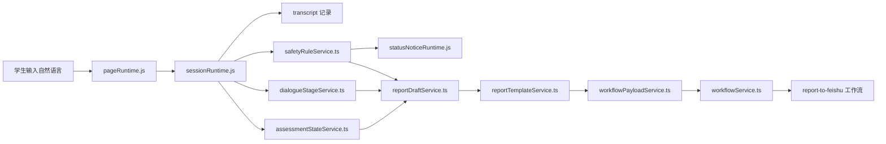

# 无感知测评改动动线讲解稿

日期：2026-07-28  
用途：下午汇报后，对“无感知测评设计对齐”这部分改动做一个简短讲解  
对应计划：
- `D:\Desktop\Software\AIUE\roadmap\2026-07-28_无感知测评智能体设计对齐计划.md`
- `D:\Desktop\Software\AIUE\roadmap\2026-07-28_无感知测评设计对齐详细开发步骤.md`

---

## 1. 一句话先讲清楚这次改了什么

这次改动的核心，不是单纯“多加了几个文件”，而是把原来偏原型式的聊天流程，升级成了一条更接近智能体设计方案的完整通路：

```text
用户自然表达
-> 系统记录会话与转录
-> 同步判断当前对话阶段
-> 同步抽取结构化测评字段
-> 同步做风险识别与证据记录
-> 生成中文非诊断后台报告
-> 按既有四字段合同上传工作流
```

也就是说，这次不是只改 UI，也不是只改报告，而是把“对话、状态、风险、报告、上传”这五段连成了一条更完整的业务动线。

---

## 2. 建议讲解顺序

汇报后建议按下面顺序讲，最顺：

1. 先讲“为什么要改”
2. 再讲“现在这条通路是怎么走的”
3. 再讲“每一段分别落在哪些代码里”
4. 最后讲“它和智能体设计计划是怎么对齐的”

如果时间只有 3-5 分钟，重点只讲第 2、4 两部分。

---

## 3. 为什么要改

可以用下面这段话直接讲：

> 之前的本地原型已经具备聊天、基础安全状态、报告草稿和飞书上传能力，但它更像是“几个能力并列放在一起”，还没有严格按无感知测评智能体方案，把每轮对话放进清晰的阶段流程里，也没有把主诉、功能影响、风险证据这些核心信息稳定地沉淀成结构化状态。  
> 这次改动的目标，就是把这些零散能力按设计方案连起来，让它变成一条可以解释、可以追踪、可以继续迁移到 NK-GeniOS 的通路。

---

## 4. 现在的主通路怎么走

### 4.1 简化版业务动线



### 4.2 讲解口径

可以这样说：

> 现在学生每发一条消息，不再只是简单地追加到聊天框里，而是会同时进入会话总线。  
> 在总线里会发生四件事：  
> 第一，记录 transcript；  
> 第二，更新当前处于 D0-D12 哪个阶段；  
> 第三，把这轮话里能用的测评字段抽出来；  
> 第四，检查有没有风险表达、拒答、否定、第三人称引用这些情况。  
> 然后这些状态再一起进入报告生成和工作流上传。

---

## 5. 每一段代码分别承担什么职责

这一部分适合对着代码目录讲。

### 5.1 `src/app/pageRuntime.js`

它是页面入口层，负责把“用户发送消息”接到新的状态总线里。

这次的关键变化：
- 用户消息不再只做 `appendTranscriptEntry`
- 现在改成走 `MentalSessionRuntime.ingestUserTurn(...)`
- agent 消息改成走 `recordAgentTurn(...)`

可以讲成：

> 以前这里更像是“UI 发消息，顺便记一下聊天记录”。  
> 现在这里变成“UI 把消息交给统一的会话运行时，由它负责后面的状态推进”。

### 5.2 `src/app/sessionRuntime.js`

这是这次最核心的通路节点。

它现在统一收口：
- transcript
- assessment
- safety
- dialogue stage
- upload/report 状态

也就是说，它相当于本地原型里的“轻量会话编排器”。

建议讲法：

> 这次最重要的改动，其实是把会话逻辑集中到了 `sessionRuntime`。  
> 这样后面不管是做本地原型、做调试快照，还是之后接 NK-GeniOS，都有一个明确的状态中心。

### 5.3 `src/domain/dialogueStage.ts` + `src/services/dialogueStageService.ts`

这部分对应设计方案里的 D0-D12 和 C1-C5。

本次落地内容：
- 显式定义 D0-D12 正常流程
- 显式定义 C1-C5 危机场景流程
- 每轮根据 consent、assessment、safety、activeView 推进当前阶段

建议讲法：

> 这部分解决的是“系统现在到底走到哪一步了”这个问题。  
> 以前只有聊天历史，现在有明确阶段，后面就能知道这轮是在收主诉、补功能影响、做安全确认，还是已经进入报告生成。

### 5.4 `src/domain/assessmentFields.ts` + `src/services/assessmentStateService.ts`

这部分对应“结构化信息收集模型”。

本次落地内容：
- 定义主诉、持续时间、校园情境、情绪、认知、行为、躯体、功能影响等字段
- 每个字段都有状态：`not_asked / collected / refused / conflicting`
- 每个字段都能记录证据

建议讲法：

> 这部分让系统从“只保存聊天文本”，变成“知道自己已经收到了哪些评估信息，还缺哪些信息”。  
> 这就是无感知测评里最重要的一层：不是让学生填表，而是系统在自然对话里慢慢把表结构补出来。

### 5.5 `src/domain/safetyEvidence.ts` + `src/services/safetyRuleService.ts`

这部分对应风险识别证据化。

本次落地内容：
- 记录风险规则编号
- 记录触发摘录
- 区分本人表达、他人引用、明确否定、拒答
- 把结果映射为 `R0 / R1 / R2 / R3 / RX`

建议讲法：

> 以前的 safety 更像一个摘要状态。  
> 现在它多了一层证据结构，所以后面我们不只是知道“它危险不危险”，还知道“为什么被判成这样”，这更符合设计里要求的可追溯和可复核。

### 5.6 `src/services/reportDraftService.ts` + `src/services/reportTemplateService.ts`

这部分对应中文非诊断报告模板。

本次落地内容：
- 从英文 prototype record 改成中文后台报告
- 报告里显示主诉、状态、功能影响、风险摘要、信息缺口、上传状态
- 显式写明“不构成医学诊断”

建议讲法：

> 这一步解决的是“后台最终留档长什么样”的问题。  
> 它不再只是调试用的英文文本，而是更接近智能体设计方案里的中文评估记录。

### 5.7 `src/services/workflowPayloadService.ts` + `src/app/uploadRuntime.js`

这部分对应飞书写入稳定化。

本次落地内容：
- payload 统一在一个 service 里构造
- 继续保持工作流四字段不变：`input`、`SEVERITY_LEVEL`、`Student_ID`、`time`
- `RX` 这种安全信息不足状态也允许进入上传

建议讲法：

> 这部分体现的是“设计对齐时不破坏现有工作流合同”。  
> 也就是内部状态结构升级了，但对外工作流接口没变，这样可以保持现有飞书链路稳定。

---

## 6. 这次改动和设计计划是怎么一一对应的

下面这个表，建议你在讲的时候直接拿来对照。

| 设计计划项 | 设计要求 | 本次落地方式 | 对应代码 |
| --- | --- | --- | --- |
| P0-1 对话阶段模型 | 显式建立 D0-D12 | 新增阶段 domain + service，并接入 session runtime | `src/domain/dialogueStage.ts` `src/services/dialogueStageService.ts` `src/app/sessionRuntime.js` |
| P0-2 结构化信息收集 | 不只存聊天文本，要存评估字段 | 新增 assessment fields 和字段状态 | `src/domain/assessmentFields.ts` `src/services/assessmentStateService.ts` |
| P0-3 风险识别证据化 | 规则编号、否定、引用、时间范围 | 新增 safety evidence 和 safety rule service | `src/domain/safetyEvidence.ts` `src/services/safetyRuleService.ts` |
| P0-4 中文非诊断报告 | 报告中文化、非诊断化、可复核 | 重写 report draft 输出通路 | `src/services/reportDraftService.ts` `src/services/reportTemplateService.ts` |
| P0-5 飞书 payload 稳定化 | 四字段入口不变，但内容更稳定 | 新增 workflow payload service | `src/services/workflowPayloadService.ts` `src/app/uploadRuntime.js` |
| 学生端与后台边界 | 学生端不显示后台完整报告和内部标签 | 前端只显示支持性提示，后台单独留档 | `src/app/statusNoticeRuntime.js` `src/utils/sanitizeText.ts` |
| snapshot / 调试可追踪 | 要能回看当前阶段和状态 | snapshot 升级为包含 assessment + safety evidence + stage | `src/services/sessionSnapshotService.ts` `src/contracts/sessionSnapshotContract.ts` |

---

## 7. 这次讲“动线”时最值得强调的 3 个点

### 7.1 从“功能并列”变成“通路串联”

可以讲：

> 以前的能力是聊天、风险、报告、上传分别存在。  
> 这次最重要的不是多了哪个功能，而是把它们串成了一条完整通路。

### 7.2 从“聊天记录”变成“结构化评估状态”

可以讲：

> 以前系统知道你说过什么，现在系统开始知道“它收集到了什么、还缺什么、当前处在哪个测评阶段”。

### 7.3 从“风险摘要”变成“风险证据”

可以讲：

> 以前更偏结果，现在哪怕后面要人工看，也能看到它为什么进入 R1/R2/RX，这一点和智能体设计方案的证据化要求是对齐的。

---

## 8. 如果你只想讲 3 分钟，可以直接照这个版本说

> 这次我主要做的不是单点功能新增，而是把无感知测评方案里的几条核心链路在代码里真正接起来了。  
> 第一条是对话阶段链路：我们把 D0 到 D12，以及危机场景 C1 到 C5，显式做成了状态。  
> 第二条是信息收集链路：系统不再只保存聊天文本，而是把主诉、持续时间、功能影响、情绪状态这些信息沉淀成结构化字段。  
> 第三条是风险链路：风险识别不再只是一个摘要标签，而是开始记录规则编号、证据摘录、否定表达和第三人称引用。  
> 第四条是报告上传链路：后台报告改成了中文、非诊断、可复核模板，同时保持飞书现有四字段合同不变。  
> 所以这次改动的本质，是让本地原型更接近智能体设计方案里的完整业务通路，而不是一个单纯可演示的聊天页面。

---

## 9. 这次讲解时不要说过头的地方

这几句建议不要讲成“已经完成”：

- 不要说“已经完成真实线上智能体闭环”
- 不要说“已经完成 NK-GeniOS 联调”
- 不要说“已经具备正式危机干预能力”
- 不要说“已经形成临床级评估报告”

建议口径：

- 说“已经在本地原型中完成 P0 设计对齐落地”
- 说“已经把关键业务动线串起来”
- 说“已经为后续 NK-GeniOS 授权通过后的迁移和联调准备好了状态与报告结构”

---

## 10. 当前状态总结

一句话总结可以用：

> 当前这版代码已经把“自然对话 -> 阶段推进 -> 结构化测评 -> 风险证据 -> 中文后台报告 -> 工作流上传”这条主通路在本地原型里打通了，并且与 2026-07-28 的无感知测评设计对齐计划形成了明确映射。

